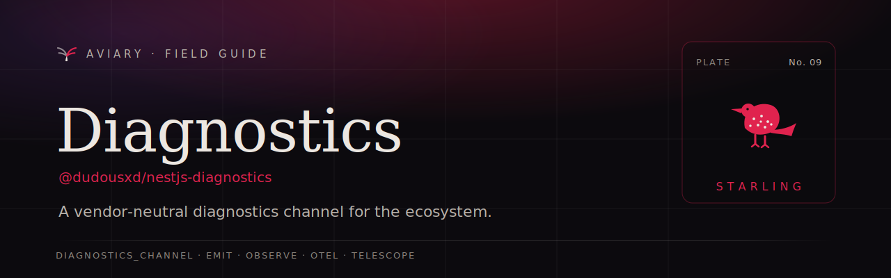

<p align="center">
  <a href="https://davidecarvalho.github.io/aviary/docs/diagnostics">
    
  </a>
</p>

<p align="center">
  <b><a href="https://davidecarvalho.github.io/aviary/docs/diagnostics">📖 Read the documentation</a></b>
  &nbsp;·&nbsp; part of the <a href="https://davidecarvalho.github.io/aviary/"><b>Aviary</b></a> ecosystem for NestJS
</p>

---

# `@dudousxd/nestjs-diagnostics`

A tiny, standard convention for `@dudousxd/nestjs-*` libraries to emit observability events over Node's built-in [`diagnostics_channel`](https://nodejs.org/api/diagnostics_channel.html) — with **zero overhead when nobody is listening**, and **never coupled to any one consumer**. A library calls `emit('authz', 'decision', payload)` and is done; whoever wants to observe it subscribes. [Telescope](https://davidecarvalho.github.io/aviary/docs/telescope) is one consumer — so is an OpenTelemetry span, an APM, a logger, or an assertion in a test.

## Packages

| Package | Description |
| --- | --- |
| [`@dudousxd/nestjs-diagnostics`](./packages/core) | The core convention — `emit`, the channel registry, and trace correlation. |
| [`@dudousxd/nestjs-diagnostics-telescope`](./packages/telescope) | One generic [Telescope](https://davidecarvalho.github.io/aviary/docs/telescope) watcher that records every `aviary:<lib>:<event>` event. |

## Install

```bash
pnpm add @dudousxd/nestjs-diagnostics
```

There's nothing to register — no module, no provider. The package is a set of functions over Node's `diagnostics_channel`.

## The convention

Every event flows over a channel named **`aviary:<lib>:<event>`** and carries a standard envelope:

```ts
interface DiagnosticEvent<TPayload = unknown> {
  ts: number;        // Date.now() at publish time
  lib: string;       // the <lib>, e.g. "authz"
  event: string;     // the <event>, e.g. "decision"
  traceId?: string;  // auto-filled from nestjs-context when present
  payload: TPayload; // your library-defined data
}
```

## Emit

Call `emit` from your provider wherever something interesting happens:

```ts
import { Injectable } from '@nestjs/common';
import { emit } from '@dudousxd/nestjs-diagnostics';

@Injectable()
export class BillingService {
  async markInvoicePaid(invoiceId: string, amount: number) {
    // … your domain logic …
    emit('billing', 'invoice-paid', { invoiceId, amount });
  }
}
```

`emit` builds and publishes the envelope **only when the channel has subscribers** (`channel.hasSubscribers`), so a production process with no observer attached pays essentially nothing per call. It never throws — observability must not break the emitting code path.

## Observe

`diagnostics_channel` has **no wildcard subscription**, so the package keeps a registry of every channel it has created. A generic consumer subscribes to all current channels and any registered later:

```ts
import { registeredChannels, onChannelRegistered } from '@dudousxd/nestjs-diagnostics';

for (const name of registeredChannels()) subscribe(name);
const off = onChannelRegistered(subscribe);
```

That's exactly how the single Telescope watcher records every event — and how you wire OpenTelemetry, an APM, or your own subscriber. See the [**Consumers** guide](https://davidecarvalho.github.io/aviary/docs/diagnostics/consumers).

## Documentation

Full docs — Quickstart, trace correlation, and every consumer integration — live in the Aviary field guide:

**→ https://davidecarvalho.github.io/aviary/docs/diagnostics**

## License

MIT
